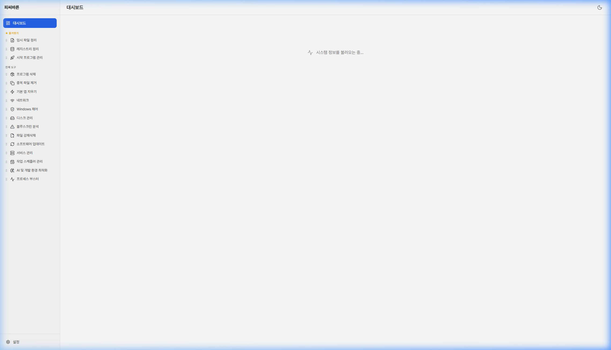
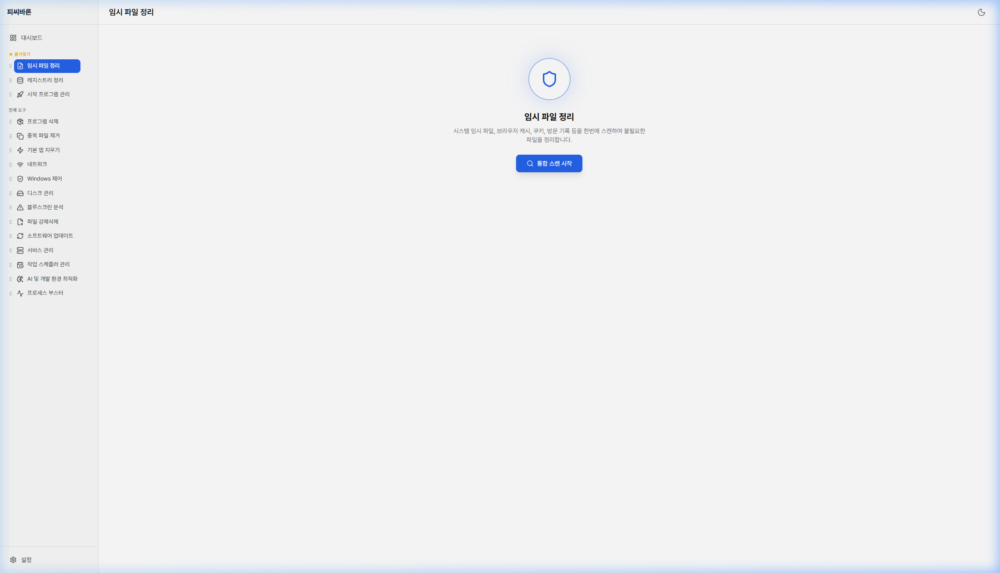
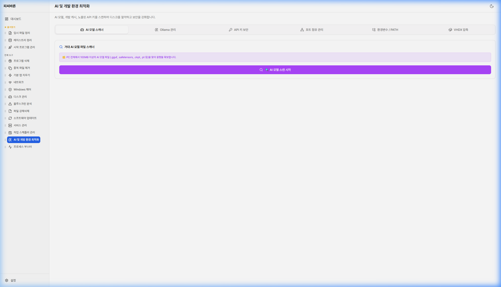

# 🖥️ PC 바른 (PC Bareun)

**당신의 PC를 바르게.**

Windows 10/11을 위한 올인원 PC 관리 유틸리티

 

[📥 다운로드](https://github.com/teemoZipsa/PCBareun/releases/latest) · [🐛 버그 리포트](https://github.com/teemoZipsa/PCBareun/issues)

---

## ✨ PC 바른이 뭔가요?

**고클린(GoClean)에서 영감을 받아 만든 차세대 PC 관리 유틸리티**입니다.

기존 PC 관리 프로그램들이 업데이트가 끊기거나 광고로 도배되는 상황에서,  
**광고 없이**, **무료로**, **현대적인 UI**와 함께 필요한 기능만 담았습니다.

> 🛡️ **안전 최우선 설계** — 시스템 핵심 서비스 보호, 다중 확인 단계, 복원 지점 자동 생성

 

## 📸 스크린샷

<table>
  <tr>
    <td align="center"><b>🏠 대시보드</b></td>
    <td align="center"><b>🧹 임시 파일 정리</b></td>
  </tr>
  <tr>
    <td></td>
    <td></td>
  </tr>
  <tr>
    <td align="center" colspan="2"><b>🤖 AI 및 개발 환경 최적화</b></td>
  </tr>
  <tr>
    <td colspan="2" align="center"></td>
  </tr>
</table>

 

## 🚀 주요 기능

### 🧹 시스템 정리
| 기능 | 설명 |
|------|------|
| **임시 파일 정리** | 시스템 임시 파일, 브라우저 캐시, 쿠키, AI 개발 캐시 통합 스캔 및 삭제 |
| **레지스트리 정리** | 사용하지 않는 레지스트리 항목 12개 카테고리 검색 및 안전 정리 |
| **중복 파일 제거** | 파일 해시 기반 중복 파일 탐지로 디스크 공간 절약 |

### 🔧 시스템 관리
| 기능 | 설명 |
|------|------|
| **시작 프로그램 관리** | 부팅 시 자동 실행 프로그램 활성화/비활성화 |
| **서비스 관리** | Windows 서비스 시작/중지/자동실행 설정 (시스템 핵심 서비스 보호) |
| **작업 스케줄러 관리** | Windows 예약 작업 확인 및 관리 |
| **프로그램 삭제** | 설치된 프로그램 관리 및 제어판 바로가기 |

### 🛡️ 보안 & 개인정보
| 기능 | 설명 |
|------|------|
| **윈도우 기본 앱 지우기** | Windows 10/11 기본 탑재 bloatware 안전 제거 |
| **텔레메트리 차단** | Microsoft 개인정보 추적 비활성화 |
| **DNS 보안 검사** | DNS 변조 여부 탐지 및 hosts 파일 검사 |
| **API 키 노출 탐지** | 프로젝트 폴더에서 노출된 시크릿/토큰 검색 |

### 💾 디스크 관리
| 기능 | 설명 |
|------|------|
| **디스크 건강 진단** | S.M.A.R.T. 기반 SSD/HDD 상태 모니터링 |
| **폴더 용량 분석** | 디스크 사용량 시각화 |
| **완전 삭제 (Secure Erase)** | Hardware Secure Erase (NVMe/SATA), Zero-Fill 지원 |

### 🤖 AI & 개발자 도구
| 기능 | 설명 |
|------|------|
| **AI 모델 스캐너** | .gguf, .safetensors 등 대용량 AI 모델 파일 탐지 |
| **Ollama 관리** | 설치된 Ollama 로컬 LLM 모델 관리 및 삭제 |
| **포트 점유 관리** | 개발 포트 충돌 확인 및 프로세스 강제 종료 |
| **환경변수 / PATH 관리** | PATH 진단, 개발 도구 버전 확인 |
| **VHDX 압축** | WSL2/Docker 가상 디스크 용량 최적화 |

### ⚡ 기타
| 기능 | 설명 |
|------|------|
| **프로세스 부스터** | 불필요한 백그라운드 프로세스 일괄 종료 |
| **Windows 제어** | 업데이트 일시정지, 전원 옵션, Recall/Copilot 제어 |
| **종료 타이머** | 시스템 종료/재시작/로그오프 예약 |
| **블루스크린 분석** | BSOD 이벤트 로그 분석 및 원인 파악 |
| **실시간 네트워크 모니터** | 네트워크 송수신 속도 실시간 모니터링 |

 

## 📥 설치 방법

### 다운로드
[**📦 최신 버전 다운로드**](https://github.com/teemoZipsa/PCBareun/releases/latest)

- `PC Bareun_x.x.x_x64-setup.exe` — 일반 인스톨러 (권장)
- `PC Bareun_x.x.x_x64_en-US.msi` — MSI 패키지

### 시스템 요구사항
- Windows 10 (1809 이상) 또는 Windows 11
- 64비트 (x64)
- [WebView2 Runtime](https://developer.microsoft.com/edge/webview2/) (Windows 11은 기본 포함)

 

## 🏗️ 기술 스택

<table>
  <tr>
    <td align="center"> <b>Tauri v2</b></td>
    <td align="center"> <b>React 19</b></td>
    <td align="center"> <b>TypeScript</b></td>
    <td align="center"> <b>Tailwind CSS v4</b></td>
    <td align="center"> <b>Rust</b></td>
  </tr>
</table>

- **프론트엔드**: React 19 + TypeScript + Tailwind CSS v4
- **백엔드**: Rust + PowerShell (시스템 관리 명령)
- **프레임워크**: Tauri v2 (경량 네이티브 앱)
- **폰트**: Pretendard Variable

 

## 🤝 피드백 & 버그 리포트

버그를 발견하셨거나 추가했으면 하는 기능이 있다면:

1. [Issues](https://github.com/teemoZipsa/PCBareun/issues) 탭에서 새 이슈를 등록해주세요
2. 가능하다면 스크린샷이나 오류 메시지를 함께 첨부해주세요

모든 피드백은 소중하게 반영됩니다 🙏

 

## 📜 라이선스

**Copyright © 2025 teemoZipsa. All Rights Reserved.**

이 소프트웨어는 **무료**로 제공되지만, 소스코드의 복제·수정·재배포는 허용되지 않습니다.  
자세한 내용은 [LICENSE](LICENSE) 파일을 참고하세요.

 

---

**Made with ❤️ for PC Health**

[⬆️ 맨 위로](#%EF%B8%8F-pc-바른-pc-bareun)

